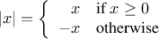
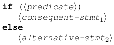

# 1.1 Elements of Programming
* Every powerful language has three mechanisms for combining simple ideas to form complex ones.
    1. Primitive Expressions, which represent the simplest entities the language is concerned with.
    2. Means of combination, by which compound elements are built from simpler ones.
    3. Means of abstraction, by which compound elements can be named as units.
 * We deal with two kinds of elements: procedures/functions and data. 

 ## 1.1.1 Expressions
 * Expressions representing numbers may be combined with an expression representing a primitive procedure (such as + or *) to form a compound expression.
    * This is called combinatorics.
* The convention known as pretty-printing, where the operands are aligned vertically, is used to increase code readability.
```scheme
(+ (* 3 (+ (* 2 4) (+ 3 5))) (+ (- 10 7) 6))


(+ (* 3
      (+ (* 2 4)
         (+ 3 5)))
   (+ (- 10 7)
      6))
```

## 1.1.2 Naming and the Environment
* In Scheme, we name things with define. In Javascript, var/let/const
```
(define pi 3.14159)
let pi = 3.14159;
```
# 1.1.3 Evaluating Combination
* Procedure for evaluating a combination:
    1. Evaluate the subexpressions of the combination.
    2. Apply the procedure that is the value of the leftmost  subexpression (the operator) to the arguments that are the values of the subexpressions (the operands).
        * Or, in JS terms: Apply the function that is denoted by the operator to the arguments that are the values of the operands.
* The evaluation is rule is recursive, because in order to accomplish the evaluation process for a combination we must perform the evaluation process on each element on the combination.
```JS
(2 + 4 * 6) * (3 + 12);
```
* We can view the evaluation process like a tree. Each of the four different expressions are a different node with branches for each operator and operand. The evaluation begins at the terminal nodes and percolates upward, combining at higher and higher levels. 


* The repeated application of the first step brings us to needing to evaluate not just combinations, but primitive expression as well. We do this by stipulating that.
    * The values of numerals are the numbers they name
    * The values of names are the objects associated with those names in the environment.
* let/defin are called *keywords* or *special forms.

## 1.1.4 Compound Procedures (Functions)

* *Procedure/Function Definitions* are a powerful abstraction technique by which a compound operation can be given aa name and referred to as a unit. 
* The general form of a procedure definition is:
```Scheme
(define (<name> <formal parameters>) <body>)
```
* We can use these procedures as building blocks for other procedures. For instance, squaring: 
```Scheme
(define (square x) (* x x))

(square 21) ;; 441

(define (sum-of-squares x y)
  (+ (square x) (square y)))

(sum-of-squares 3 4) ;; 25

(define (f a )
  (sum-of-squares (+ a 1) (* a 2)))
(f 5) ;;136
```

## 1.1.5 The Substitution Model for Procedure Application

* The application process for compound procedures: 
    * To apply a compound procedure to arguments, evaluate the body of the procedure with each formal parameter replaced by the corresponding argument.
    * In js terms: To apply a function to arguments, evaluate the return expression of the body of the function with each formal parameter replaced by the corresponding argument.

## 1.1.6 Conditional Expressions and Predicates

* What if we wanted to calculate the absolute value? 


* This construst is called a *case analysis* or a *conditional*. In lisp, we would use a special form called cond (short for conditional). 
```Scheme
(define (abs x)
  (cond ((> x 0) x)
        ((= x 0) 0)
        ((< x 0) (- x))))
(abs -3) ;; 3
```
* The general form of a conditional statement is: 

* The interpreter starts by evaluating the predicate as being true or false. If it evaluates as true, the inerpreter evaluates the consequent expression. Otherwise, it evaluates the alternative expression.
* In Scheme, the absolute-value procedure can also be written: 
```Scheme
(define (abs x)
  (if (< x 0)
      (- x)
      x))
(abs -12) ;;12
```
* Here, the special form *if* is a restricted type of conditional that can be used when there are precisely two cases in the analysis. 
* The three most widely used logical composition operators in Scheme are:
```Scheme
(and <e1> ... <en>)
(or <e1> ... <en>)
(not <e>)

;; examples

(define (>= x y) 
  (or (> x y) (= x y)))
(>= 2 3) ;; #f
(>= 3 2) ;; #t

(define (>= x y)
  (not (< x y)))
(>= 7 4) ;; #t
```
* Notice that *or* and *and* are both special forms, not procedures, because the subexpressions might not be evaluated. *not*, however, is an ordinary procedure, or *prefix argument* in JS. 